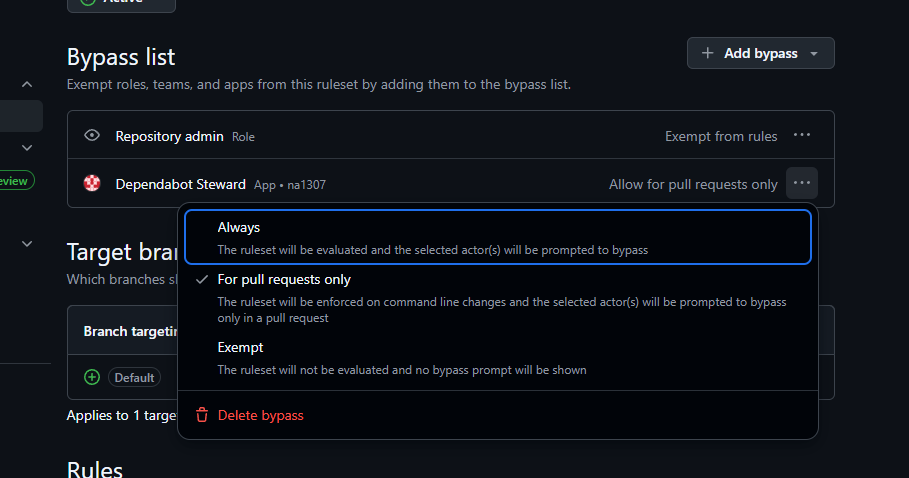

# Dependabot Steward

Dependabot Steward is a GitHub App built with [Probot](https://probot.github.io/) that automatically merges Dependabot pull requests when all status checks have passed.

## How To Use

1. Install the App. You can install it to the repositories you want, or to all repositories.
2. If you've set up a ruleset, add Dependabot Steward to the bypass list. "Allow for pull requests only" is sufficient.
   
3. Optionally create a `.steward.yml` file in your repository. An example of this file is:
   ```yml
   # A switch for every ecosystem.
   # If false, the Steward will ignore this repository no matter what comes after.
   # Default: true
   enable: true

   # -- OR --

   # Ecosystem name. This must be the ecosystem name defined in the dependabot-core
   # repository (https://github.com/dependabot/dependabot-core), not the ecosystem
   # name defined in dependabot.yml.
   npm_and_yarn:
     # Whether to enable Steward for this ecosystem.
     # Default: true
     enable: true
   ```
4. That's it!

## How It Works

1.  The app listens for the `check_suite.completed` webhook event.
2.  When a check suite completes, it verifies the following conditions for the associated pull request:
    *   The pull request was created by Dependabot.
    *   The pull request is not from a forked repository.
    *   All required status checks and branch protection rules have passed.
3.  If all conditions are met, the app will:
    *   Approve the pull request.
    *   Merge the pull request using the repository's default merge method (merge, squash, or rebase).

This helps maintain dependencies by ensuring that updates are automatically merged only when they are safe to do so, without manual intervention.

## License

MIT License.
